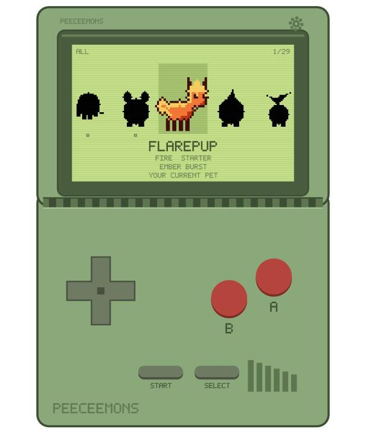
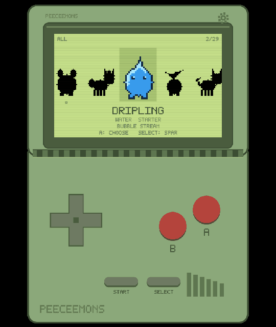
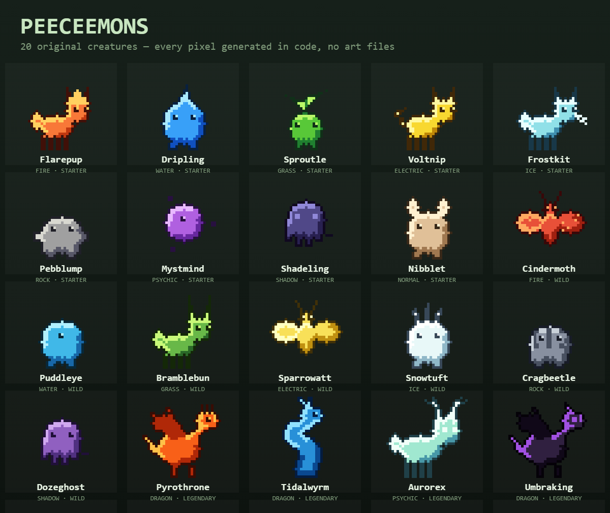

# Peeceemons

A tiny Game Boy Color–style critter that lives at the bottom of your screen.

It walks about over your taskbar, blinks, dozes off, glances at your mouse, and
now and then shows off its signature move. A little clamshell device lets you
pick which of your creatures is out, and every so often something rustles in
the grass next to your pet — click it to battle, and win enough to add that
creature to your collection.

All 29 creatures — 20 to find and 9 more to earn by evolving — are original
designs made for this app.

▶️ **[Watch the 48-second walkthrough](media/demo.mp4)** — cold start, the pet
roaming, the device, and a couple of battles.

> **In a hurry?** [`CHEATSHEET.md`](CHEATSHEET.md) is the one-page version:
> install, start, stop, hotkeys and troubleshooting.

---

## Installing

1. Download `Peeceemons_0.1.0_x64-setup.exe` from the Releases page.
2. Run it. Windows SmartScreen will probably warn you that the publisher is
   unknown — that is just because the app is not code-signed. Click
   **More info → Run anyway**.
3. It installs for your user only (no admin prompt) and adds a Start Menu and
   Desktop shortcut.

There is also a portable `.zip` if you would rather not install anything: unzip
it anywhere and run `peeceemons.exe`.

**Requirements:** Windows 10 or 11. Nothing else — WebView2 is already part of
Windows.

---

## Using it

Your pet appears along the bottom of your main screen straight away. You can
click straight through it to anything underneath — the only clickable part is
the creature itself.

### The device

Press **Ctrl + Alt + P** to show or hide the clamshell.

| Control | Keyboard | What it does |
|---|---|---|
| D-pad ← → | Arrow keys | Flick through creatures |
| D-pad ↑ ↓ | Arrow keys | Filter by All / Starter / Wild / Legendary |
| **A** | Enter | Choose the highlighted creature (or start a practice battle) |
| **B** | Backspace / Esc | Back, or flee a battle |
| **START** | S | Start / stop the pet roaming |
| **SELECT** | Tab | Spar with the highlighted creature, or make the pet do its move |
| ⚙ (top right) | — | Options |

The whole thing works by keyboard alone. Drag it anywhere by its body; it
remembers where you left it.

### Global hotkeys

These work no matter what app you are in:

| Hotkey | What it does |
|---|---|
| **Ctrl + Alt + P** | Show / hide the device |
| **Ctrl + Alt + M** | Make the pet do its move |
| **Ctrl + Alt + O** | Start / stop roaming |
| **Ctrl + Alt + Q** | **Quit Peeceemons completely** |

If another app has already claimed one of these, the device tells you so on its
screen rather than silently doing nothing.

---

## Collecting the other creatures

You start with the nine starters. The other eleven have to be earned.

Every so often — about once or twice an hour by default — **grass rustles
around your pet and a `!` pops up over its head**. Click your pet while that is
happening and a battle starts against a wild creature.

- Press **A** to attack. Your creature uses its own signature move.
- Type matters. Fire beats Grass, Water beats Fire, and so on — the full chart
  is in **Options → Type chart**.
- Beat the same creature enough times and it joins you. Commons take 3–5 wins,
  legendaries 7–10, and each individual creature has its own number. The dots
  under a locked creature show how far along you are.
- Losing costs you nothing but the progress you did not make.

Want to fight without waiting? Highlight anyone in the carousel and press
**SELECT** to spar with them, or use **Options → Practice battle** (or **A** on
the main screen) for a random opponent. Practice cannot catch anything — but
it does train your own creature, so it still counts towards evolving.

If encounters are too frequent or too rare, change **Options → Wild
encounters** (or set it to Off).

### Battles in detail

- Attacks miss about one time in ten.
- A landed hit has a small chance of leaving a status: Fire **burns**, Grass
  **seeds** you (draining health to your opponent), Electric **paralyses**,
  Ice **chills**, Shadow **curses**, Psychic **confuses**, and Water, Rock and
  Dragon each sap attack. Normal leaves nothing.
- Health and attack depend on both rarity and the individual creature — no two
  are quite alike, and legendaries are a real fight.

### Evolutions

The nine starters evolve. Win **10 battles while using one** — practice counts
— and it becomes its evolved form: Flarepup → Blazehound, Dripling → Tidefin,
Sproutle → Bloomstalk, Voltnip → Sparkfang, Frostkit → Glacelynx, Pebblump →
Boulderon, Mystmind → Aethermind, Shadeling → Nightveil, Nibblet → Thumpaw.

Evolved forms are bigger, keep their type and signature move, hit noticeably
harder, and join your collection alongside everyone else — they have their own
**Evolved** filter on the D-pad. They never appear in the wild; the only way to
get one is to earn it.

That makes 29 creatures in all: 20 to find, 9 to earn.

Here are the 20 base forms. Every pixel is generated at runtime from a
four-colour palette and a seed — there are no image files anywhere in the app
(see [`SPRITES.md`](SPRITES.md)).

---

## Options

Open with the ⚙ on the device.

- **Move timer** — how often the pet does its move on its own
- **Move hotkey** — cycle between a few safe combinations
- **Sound** — retro blips, off by default
- **Reduced motion** — turns off screen shake and thins out the particles
- **Start with PC** — launch Peeceemons when you log in
- **Pet size** — 1× to 6×
- **Device size** — 50% to 200%, if the clamshell is too small or too large
- **Wild encounters** — how often something turns up, or Off
- **Practice battle** — a no-stakes fight against a random creature
- **Type chart** / **Hotkey list** — reference screens
- **Reset all** — back to defaults

Everything is saved automatically to
`%APPDATA%\com.peeceemons.app\peeceemons.config.json`.

---

## How do I get rid of it?

Press **Ctrl + Alt + Q**, or uninstall it from Windows Settings → Apps like any
other program. It does not run in the background once quit, and it does not add
itself to startup unless you turn that on.

---

## For the curious

Peeceemons is a [Tauri](https://tauri.app) app: a small Rust shell around a
plain HTML/CSS/JavaScript frontend. There is no bundler and no `node_modules`.

- `src/` — the whole app. Canvas rendering, the creature state machine, the
  ten type moves (one file each in `src/engine/moves/`), and the roster in
  `src/data/creatures.json`
- `src-tauri/` — the Rust shell: windows, global hotkeys, config file, and the
  cursor watcher that makes the overlay click-through everywhere except the pet
- `sprite-pipeline/` — optional. Generates real pixel art for the creatures
  with a local ComfyUI. See `SPRITES.md`
- `media/` — the screenshots, animations and demo video used above, with
  [notes on how each was captured](media/README.md)

The creatures you see are drawn procedurally from each one's four-colour
palette, so the app is complete without any art files. Drop real sprite sheets
into `src/assets/sprites/<Name>/` and it uses those instead, automatically.

Two developer pages ship with the app and are handy if you are poking at it:
open `devtest.html` for every creature's sheets, or `movetest.html` for all ten
move animations.
